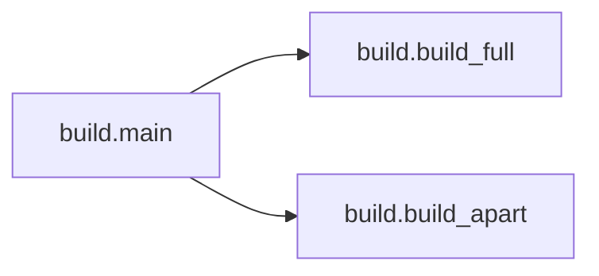

# Key Objects

[_Documentation generated by Documatic_](https://www.documatic.com)

<!---Documatic-section-build.main-start--->
## build.main

<!---Documatic-section-main-start--->


### Object Calls

* build.build_full
* build.build_apart

<!---Documatic-block-build.main-start--->
<details>
	<summary><code>build.main</code> code snippet</summary>

```python
def main():
    global mode
    argc = len(sys.argv)
    if argc > 2:
        sys.exit(2)
    elif argc == 2:
        if sys.argv[1] != 'full' and sys.argv[1] != 'apart':
            sys.exit(2)
        else:
            mode = sys.argv[1]
    else:
        mode = default_mode
    if mode == 'full':
        build_full(contents)
        build_full(summary)
    else:
        build_apart(contents)
        build_apart(summary)
    filelist = os.listdir('.')
    filelist.sort()
    for (i, f) in enumerate(filelist):
        if f in exclude or f == summary or f == contents:
            continue
        (root, ext) = os.path.splitext(f)
        if ext == '.md':
            if mode == 'full':
                build_full(f)
            else:
                build_apart(f)
```
</details>
<!---Documatic-block-build.main-end--->
<!---Documatic-section-main-end--->

# #
<!---Documatic-section-build.main-end--->

<!---Documatic-section-build.build_full-start--->
## build.build_full

<!---Documatic-section-build_full-start--->
<!---Documatic-block-build.build_full-start--->
<details>
	<summary><code>build.build_full</code> code snippet</summary>

```python
def build_full(f):
    global is_meta_gen
    (root, ext) = os.path.splitext(f)
    target = full_target
    if is_meta_gen == False and os.path.exists(target):
        os.remove(target)
    md = codecs.open(f, 'r', 'utf-8')
    content = md.read()
    html_content = markdown.markdown(content)
    html = codecs.open(target, 'a', 'utf-8', 'xmlcharrefreplace')
    html_content = re.sub('"([^"]*)\\.md"', '"#\\1"', html_content)
    if is_meta_gen == False:
        html.write('<meta charset="utf-8">\n')
        is_meta_gen = True
    html.write('<a name="' + root + '"></a>\n')
    html.write(html_content)
```
</details>
<!---Documatic-block-build.build_full-end--->
<!---Documatic-section-build_full-end--->

# #
<!---Documatic-section-build.build_full-end--->

<!---Documatic-section-build.build_apart-start--->
## build.build_apart

<!---Documatic-section-build_apart-start--->
<!---Documatic-block-build.build_apart-start--->
<details>
	<summary><code>build.build_apart</code> code snippet</summary>

```python
def build_apart(f):
    (root, ext) = os.path.splitext(f)
    target = root + '.html'
    md = codecs.open(f, 'r', 'utf-8')
    content = md.read()
    html_content = markdown.markdown(content)
    html = codecs.open(target, 'w', 'utf-8', 'xmlcharrefreplace')
    html_content = re.sub('md', 'html', html_content)
    html.write('<meta charset="utf-8">\n')
    html.write(html_content)
```
</details>
<!---Documatic-block-build.build_apart-end--->
<!---Documatic-section-build_apart-end--->

# #
<!---Documatic-section-build.build_apart-end--->

[_Documentation generated by Documatic_](https://www.documatic.com)